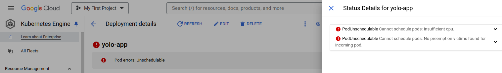

# Week 8 IP Orchestration Using Kubernetes
Requirements:
- Use of Docker files and images from Docker Hub (https://hub.docker.com/u/marynjuguna1)
- Implement orchestration and host the project on Google Kubernetes Engine (GKE)

## Objectives
 - **Choice of the Kubernetes objects used for deployment**

  . **Pod** - This is the basic unit representing a co-located group of containers of which they share storage and network.
          This was created via deployment.

  . **Deployments** - They mange replicasets to ensure a desired number of pod replicas are running for the application.
                 
   
   . **Services** -  They expose application runningpods through a network which allows external access

   . **Namespaces** - Isolate resources within a cluster by creating virtual clusters.

 - **Method used to expose pods to internet traffic**

 - **Use-of or there-lack-of of persistent storage**

 - **Git workflow used to achieve the task**

 
 
 - **Succesful running the applications**

 I was unable to successfully deploy the application on Google Kubernetes Engine due do insufficient CPU space.
 
  

 - **Docker images**

 I used these docker images:
  
   marynjuguna1/yolo_backend:v1.1

   marynjuguna1/yolo_client:v1.1

   mongo
