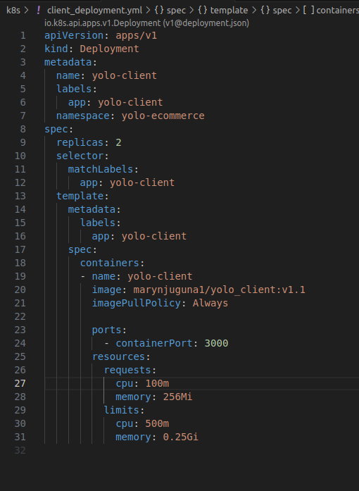

# Week 8 IP Orchestration Using Kubernetes
Requirements:
- Use of Docker files and images from Docker Hub (https://hub.docker.com/u/marynjuguna1)
- Implement orchestration and host the project on Google Kubernetes Engine (GKE)

## Objectives
 - **Choice of the Kubernetes objects used for deployment**

  1.  **Pod** - This is the basic unit representing a co-located group of containers of which they share storage and network.
          This was created via deployment.

  2.  **Deployments** - They mange replicasets to ensure a desired number of pod replicas are running for the application.
                        
I created two deployments, one for the backend and the one for the client. They both contained the names of the containers, docker images, replicasets, the container ports, resources allocated and the name of the namespace.

  ;  

                 
   
   3.  **Services** -  They expose application runningpods through a network which allows external access.
I created 3 services; backend_service, client_service and mongo_service. They all contained the ports to be exposed in order to ensure communication among the pods.
  
   

   

   

   4.  **Namespaces** - Isolate resources within a cluster by creating virtual clusters.

    

 - **Method used to expose pods to internet traffic**

 Services were used to ensure that there is communication among the pods

 - **Use-of or there-lack-of of persistent storage**

 - **Git workflow used to achieve the task**

 ba060dd (HEAD -> master, origin/master, origin/HEAD) Modified README.md

4184299 Modified README.md file

adec8d3 Modified client_deployment.yml

102ccf8 Modified backend_deployment.yml,backend_service.yml,client_deployment.yml,client_service.yml

e7f1fc0 Modified backend_deployment.yml

c613789 Modified README.md

8d42ecc Added git workflow on the README.md

828d1c6 added mongo_service object and also modified some of the other objects

e853c67 Created a k8s folder which contains kubernetes objects such as deployments, services,namespaces and network

a2d5def Describing the the kubernetes objects i used for deployment

801f209 Added Requirements and Objectives of the project to the README.md file

 
 - **Succesful running the applications**

 I was unable to successfully deploy the application on Google Kubernetes Engine due do insufficient CPU space.
 
  

 - **Docker images**

 I used these docker images:
  
   marynjuguna1/yolo_backend:v1.1

   marynjuguna1/yolo_client:v1.1

   mongo
