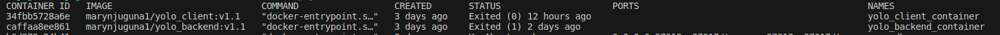

# Objectives
1. Reason(s) for the choice of the base image on which to build each container.

   I used node:16-alpine as the base image because it's relatively smaller compared to node: 16. Due to its smaller size, it ensures faster download during image creation and deployment. It also occupies less space on the Docker host and utilizes lower resources such as memory when running containers.

2. Dockerfiles directives used in the creation and running of each container.
 I used two Dockerfiles. one for the backend and the other one for the client.

 **Backend Dockerfile**

 **Client Dockerfile**

3. Docker compose Networking(Application port allocation and a bridge network implementation)

On docker-compose file, I created the network named marynjuguna1-network which was used to connect all the three sevices namely; mongo_db, backend and client. Each port had a specified port as follows:

mongo_db - ports:
      - 27018:27017

backend - ports:
      - '5000:5000'

client - ports:
      - '3000:3000'

 **Docker-compose file**

4. Git workflow used to achieve the task
5. Successful running of the applications and if not, debugging measures applied.
6. Good practices such as Docker image tag naming standards for ease of identification of images and containers.

 **Docker Images**

 **Docker Containers**

7. Screenshot of deployed image on DockerHub, clearly showing the version of the image.

 **Docker hub backend**

 **Docker hub client**

