# Objectives
1. Reason(s) for the choice of the base image on which to build each container.

   I used node:16-alpine as the base image because it's relatively smaller compared to node: 16. Due to its smaller size, it ensures faster download during image creation and deployment. It also occupies less space on the Docker host and utilizes lower resources such as memory when running containers.

2. Dockerfiles directives used in the creation and running of each container.
 I used two Dockerfiles. one for the backend and the other one for the client.

 **Backend Dockerfile**

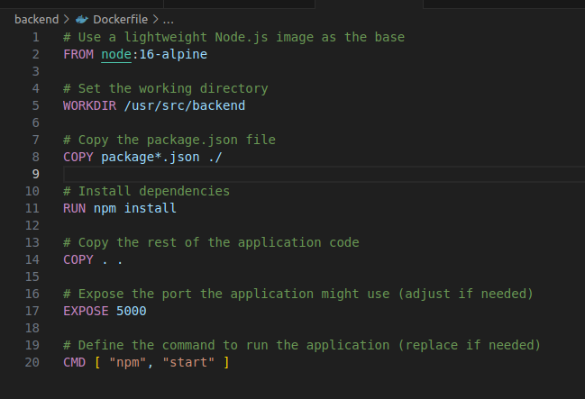

 **Client Dockerfile**

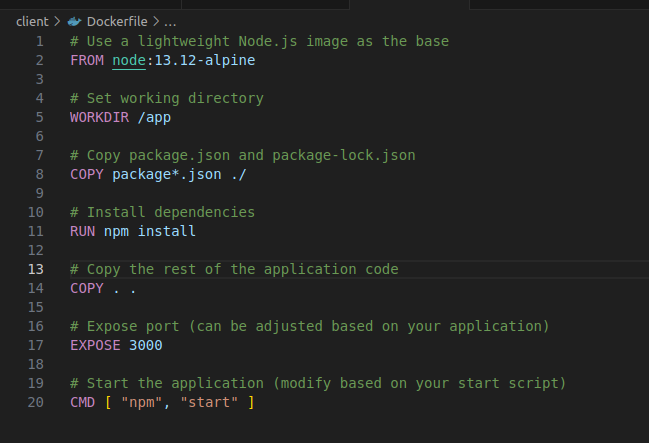

3. Docker compose Networking(Application port allocation and a bridge network implementation)

On docker-compose file, I created the network named marynjuguna1-network which was used to connect all the three sevices namely; mongo_db, backend and client. Each port had a specified port as follows:

mongo_db - ports:
      - 27017:27017

backend - ports:
      - '5000:5000'

client - ports:
      - '3000:3000'

 **Docker-compose file**

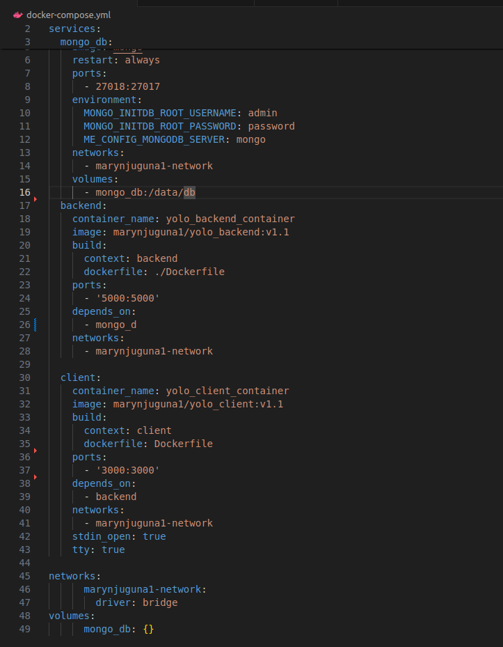

4. Git workflow used to achieve the task

I used git log to retrieve all the commits that I have listed below:

mnjuguna@mnjuguna-ThinkPad-E14-Gen-4:~/Documents/Week4Ip/yolo$ git log
commit a7a3d504963758385d0a1dc3b5dc8cfa0a1162e1 (HEAD -> master, origin/master, origin/HEAD)
Author: Mary-softeng <marysofteng@gmail.com>
Date:   Wed May 1 22:26:47 2024 +0300

    Added docker container snapshot

commit 62c84b816583df730031beea4fa1afecda1aa9b1
Author: Mary-softeng <marysofteng@gmail.com>
Date:   Wed May 1 22:18:05 2024 +0300

    Added more snapshots on image folder, modified docker-compose.yml by adding a property that the containers should always restart incase they stop unexpectedly. Modified explanation.md by outlining the debugging processes.

commit 5cd0bc56542d6fb4b95ec6523191b4bdc0ef0731
Author: Mary-softeng <marysofteng@gmail.com>
Date:   Wed May 1 18:13:21 2024 +0300

    added snapshots on image folder, modified docker-compose file, renamed both client and backend Docker files

commit 7945975b1a83156693c03a3a658ef2673d01b35d
Author: Mary-softeng <marysofteng@gmail.com>
Date:   Mon Apr 29 21:12:25 2024 +0300

    Modified explanation.md file

commit d97ab738dc829b4ebb63158227c587e2e85f49fd
Author: Mary-softeng <marysofteng@gmail.com>
Date:   Mon Apr 29 20:57:46 2024 +0300

    Added images on the images folder, modified docker-compose file and explanation.md file

commit a6c68a3ab7e22061af2e77f2d6259ed1308b9f8c
Author: Mary-softeng <marysofteng@gmail.com>
Date:   Mon Apr 29 20:20:16 2024 +0300

    Modified explanation file by adding clent Dockerfile snapshotpath

commit 296ca82f3811e4e06385a0589d1df56b0339d8eb
Author: Mary-softeng <marysofteng@gmail.com>
Date:   Mon Apr 29 20:13:39 2024 +0300

    Modified explanation.md file, created Images folder to store all the snapshots

commit 078fd045494aa0bf91c67a7d40a9e566197c0102
Author: Mary-softeng <marysofteng@gmail.com>
Date:   Mon Apr 29 19:49:57 2024 +0300

    Modified docker-compose.yml

commit d2137d624e70dbd6418686e24c311c7b0ca95946
Author: Mary-softeng <marysofteng@gmail.com>
Date:   Fri Apr 26 10:44:09 2024 +0300

    Modified docker-compose.yml by adding images names

commit ac658e12230cf91659f000aa24b2c1d0e10842b4
Author: Mary-softeng <marysofteng@gmail.com>
Date:   Fri Apr 26 09:10:47 2024 +0300

    Created a docker-compose.yml

commit e3649f6d590cb7ef88eedcfe854f32275be0594d
Author: Mary-softeng <marysofteng@gmail.com>
Date:   Fri Apr 26 07:16:22 2024 +0300

    Greated dockerignore file in order to exclede node_modules files while copying the images

commit 0e8ff5bf0ca42dbf8c7a02867588b85667b6114c
Author: Mary-softeng <marysofteng@gmail.com>
Date:   Fri Apr 26 07:03:28 2024 +0300

    Modified docker file

commit 756d088e0cbe7ae32ec71a92b67104d779e1df6b
Author: Mary-softeng <marysofteng@gmail.com>
Date:   Thu Apr 25 21:15:38 2024 +0300

    modified the server.js by changing mongodb_url

commit 4cff02667b7789d6f93d5b2a7fe9ea249e4fb099
Author: Mary-softeng <marysofteng@gmail.com>
Date:   Thu Apr 25 20:58:43 2024 +0300

    Created dockerignore file to exlude node_modules

commit 5d6fe8221fdc3b2c5bbfae0012ce08bb8df41028
Author: Mary-softeng <marysofteng@gmail.com>
Date:   Thu Apr 25 14:31:56 2024 +0300

    Modified Dockerfile in the backend folder by adding instructions to run the container

commit 742e7e1d523a3596696a77f2d4631a88d9db77a7
Author: Mary-softeng <marysofteng@gmail.com>
Date:   Thu Apr 25 14:22:52 2024 +0300

    Created a Dockerfile on backend folder

commit 351a2121e56081e086e43ddc8494d582b2adb051
Author: Mary-softeng <marysofteng@gmail.com>
Date:   Thu Apr 25 14:16:19 2024 +0300

    Updated Dockerfile in the client folder by adding the instractions to run the application and also created the first image named yolo-client:v1.0 and pushed it to the docker 
hub

commit 2bce7c724bdfac6d1845edcec34c6640da644def
Author: Mary-softeng <marysofteng@gmail.com>
Date:   Thu Apr 25 13:53:33 2024 +0300

    Created DockerFile on client folder

commit 84b2e69f3c19452219612238b149299838f185b3
Author: Mary-softeng <marysofteng@gmail.com>
Date:   Thu Apr 25 13:50:32 2024 +0300

    Modified the explanation.md file by adding the objectives of the IP

commit 58e2147b330fa4d9f1f31906b93037526ee3acf9
Author: Mary-softeng <marysofteng@gmail.com>
Date:   Thu Apr 25 13:38:05 2024 +0300

    Created explanation.md file

commit f8b5e595929a713416df84e614d48421980ccd0e
Author: Mary-softeng <marysofteng@gmail.com>
Date:   Thu Apr 25 13:29:00 2024 +0300

    Installed dependencies on backend folder

commit f2413331262111ab2b60fbca8438f101b9d14b07
Author: Mary-softeng <marysofteng@gmail.com>
Date:   Thu Apr 25 13:21:07 2024 +0300

    Installed dependencies on client folder

commit 2fce89b63ee606d4caec526108b9708397c0abe0
Author: vinge1718 <vinge1718@gmail.com>
Date:   Sun Aug 30 11:58:29 2020 +0300

    made some instructional changes

commit 9e6eaeac653c849094ec129bb425c0a54c968a5b
Author: vinge1718 <vinge1718@gmail.com>
Date:   Tue Aug 25 06:22:52 2020 +0300

    added the instructions to run the app for DevOps IP

commit 969e52604e581b0aeaf84df359ab02e92daf4a4e
Author: john mutavi <jonnygovish@gmail.com>
Date:   Mon Aug 24 14:09:34 2020 +0300

    folder structure change

commit 6499b80a503c1578dbe68f6cf66409399d6ba372
Author: john mutavi <jonnygovish@gmail.com>
Date:   Mon Jul 13 13:53:14 2020 +0300

    Minor change

commit 0e667dbe40ced47a02036cc168128ef74fd8e8dc
Author: john mutavi <jonnygovish@gmail.com>
Date:   Mon Jul 13 13:51:21 2020 +0300

    configuration for deployment

commit 2fbaef7f6b505fbecb26c5708a52f73d233c34aa
Author: john mutavi <jonnygovish@gmail.com>
Date:   Mon Jul 13 13:29:34 2020 +0300

    Add  components

commit dc0b1c0f4fba263413d800733963d4358702a262
Author: john mutavi <jonnygovish@gmail.com>
Date:   Mon Jul 13 13:28:37 2020 +0300

    Initial commit

commit 809ba30d8752534276d370ac6ff0abdd28e486aa
Author: john mutavi <jonnygovish@gmail.com>
Date:   Fri Jul 3 16:19:46 2020 +0300

    Initialize project using Create React App
(END)

5. Successful running of the applications and if not, debugging measures applied.

The cliient side successfully excecuted on port 3000

 **Client side**

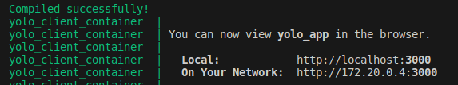

There was a break in communication with the mondodb despite :

**a. The fact that all the containers were running**

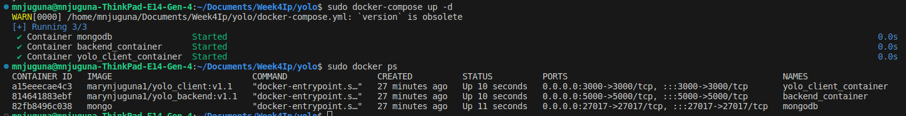

**b. The backend-container was listening on port 5000**

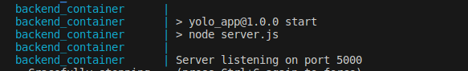

**c. All three services connected to one network**

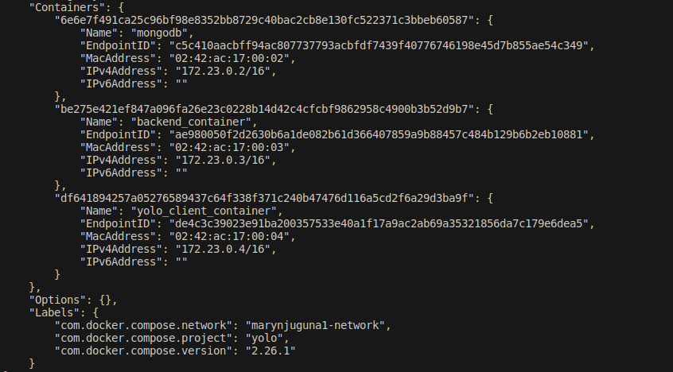

**c. Backend-container was able to communicate with mongo_db**

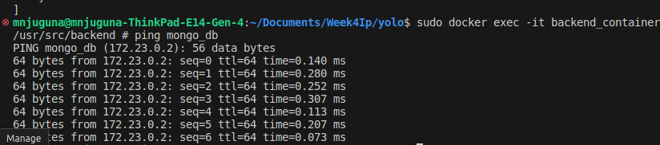

**c. Backend-container was able to communicate with client_container**

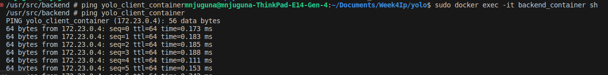

6. Good practices such as Docker image tag naming standards for ease of identification of images and containers.

 **Docker Images**

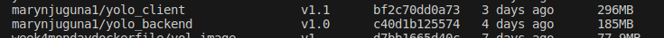

 **Docker Containers**

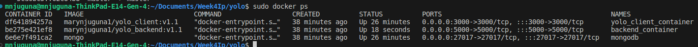

7. Screenshot of deployed image on DockerHub, clearly showing the version of the image.

 **Docker hub backend**

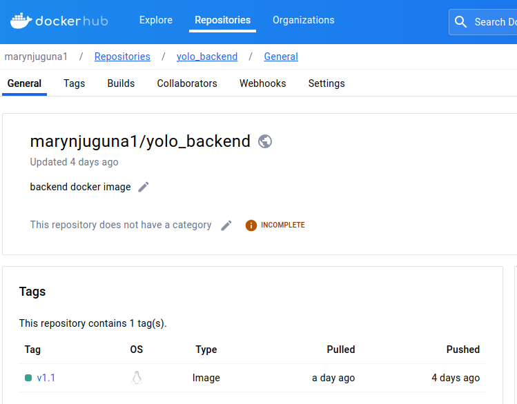

 **Docker hub client**

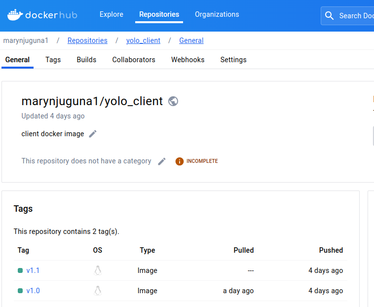